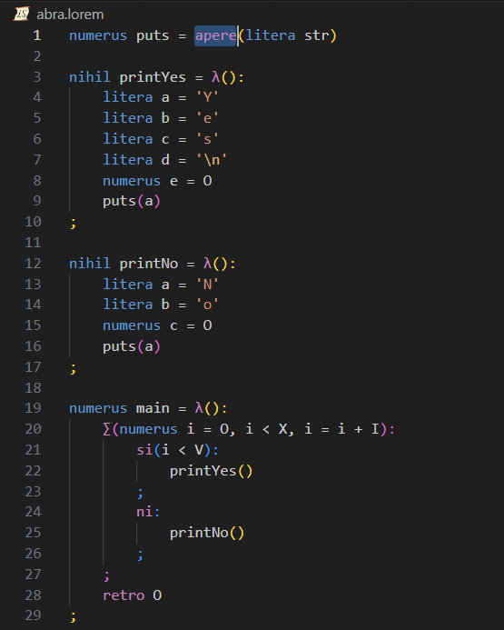
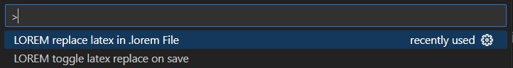

# loremscriptum README

This is the README for your extension "loremscriptum". After writing up a brief description, we recommend including the following sections.

This is a simple syntax highlighting and "to unicode coverter" Extention for the esolang "LoremScriptum".

## Features

**Highlighting of:**
* Datatypes
* Imports
* Brackets (functionally same as in VisualStudio)
* Function Declarations
* return-Statements
* comments
* and Control-Structure

**Conversion of:**
* "==" => ⇔
* "!=" => ≠
* "<=" => ≤
* ">=" => ≥
* "\sum" => ∑
* "*" => ×
* "/" => ÷
* "\neg" => ¬
* "\lambda" => λ

done via "Command Palette"

## Requirements

To execute our llvm based compiler is required! (TODO: add link) 

## Extension Settings
"loremscriptum.toggleReplace"  == LOREM toggle latex replace on save
"loremscriptum.replaceLatex" == LOREM replace latex in .lorem File

## Known Issues

currently none

## Release Notes

Users appreciate release notes as you update your extension.

### 1.0.0

Initial release of Extention

**Enjoy!**
